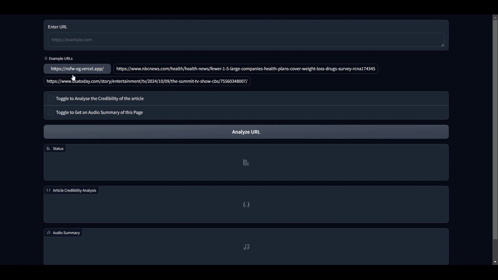

# Arishtha

A 'Content Moderation Tool' utilizing Multimodal Agentic approach which can be embedded within an Browser.


_Figure 1: Process-Flow/Architecture Diagram_

## Demo


_Figure 2: Admin Page_

## Getting Started

### Environment Variables:

To run this project, you will be needing the following environment variable. Where to add one will be discussed later.

`GEMINI_API_KEY` - This can be accessed from [Google AI Studio](https://aistudio.google.com/app/prompts/new_chat/?utm_source=hackathon&utm_medium=referral&utm_campaign=Devfolio&utm_content=)

### Prerequisites:

- Python3 Installed
- pip Package Manager

## Run Locally

Start with creating an Virtual Environment and activating it. ( for windows )

```bash
python -m venv myenv
myenv/Scripts/activate
```

Clone this Repository

```bash
git clone https://github.com/Avinash-Acharya/Content_Moderation.git
```

Now create a `.env` file in the root directory of this project and add an variable `GEMINI_API_KEY` with key that you obtained by following the steps till now.
Something Like this ;

```bash
GEMINI_API_KEY = Ahfksckiljdcoajsidf8wur34rfnk
  (This is an example and not an actual key)
```

Install the necessary Python Libraries

```bash
pip install -r requirements.txt
```

And at last you can run Gradio Application to view the working proto-type

```bash
python client.py
```

> Note : If you are running this project for the very first time, then the initial loading time will be quite long since the project tries to load the transformers model to your system cache.

> Note : If your system does not have ffmpeg and yt-dlp, then the project will not run. Or else Download these two files from [here](https://github.com/Avinash-Acharya/yt-dlp_x_ffmpeg.git) and save it in the root directory of this project under the file name `yt-dlp`.

## Screenshots


_Figure 9: Gradio Application on browser With no URL as Input_


_Figure 10: Post Processing on the Example URL_

URL: `https://nsfw-eg.vercel.app/` [⚠️Harsh Words WARNING!!⚠️]
(This Webpage was built for testing purpose)

## License

MIT
